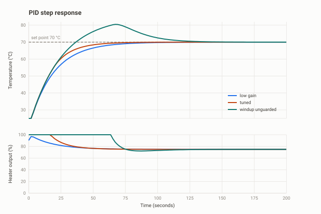

# Embedded PID Temperature Controller

A discrete PID controller in C running at a fixed 10 Hz on an ATmega328P, with
the heater and its thermal behaviour simulated inside the firmware so the whole
loop runs in a browser with no hardware. A matching Python model lets gains be
swept on the laptop, and an analysis script measures the step response the way
a control engineer would.



## Measured from three runs

| Tuning | Rise time (10-90 %) | Overshoot | Settling (±2 %) | Steady-state error |
|---|---|---|---|---|
| low gain | 41.1 s | 0.0 % | 75.6 s | 0.00 °C |
| tuned | 31.5 s | 0.0 % | 58.5 s | 0.00 °C |
| same gains, windup unguarded | 26.1 s | 23.3 % | 116.6 s | 0.00 °C |

The third row is the point of the project. It uses exactly the same gains as the
tuned row. The only difference is that the integral term is allowed to keep
accumulating while the output is already saturated at 100 %. That single
omission turns a well-behaved loop into one that overshoots by 10 °C and takes
twice as long to settle.

The three runs are generated files rather than committed data. The commands under
"Run it" below reproduce them exactly, because the model is deterministic.

## The two details that separate this from a textbook transcription

**Derivative on the measurement, not on the error.** The textbook form is
`d = Kd * de/dt`. When the set point jumps, the error jumps with it, its
derivative is enormous for one sample, and the output slams into its limit. That
is called derivative kick. Differentiating the measurement instead gives the
same behaviour in steady operation and none of the kick:

```c
float d = -kd * (measurement - lastMeas) / DT;
```

**Conditional integration for anti-windup.** While the heater is already at full
power, more integral cannot produce more heat; it only builds a number that has
to be unwound later. So the integral is frozen whenever integrating further
would push deeper into a limit that has already been reached:

```c
bool windingUp = (unsaturated >= OUT_MAX && error > 0.0f) ||
                 (unsaturated <= OUT_MIN && error < 0.0f);
if (!windingUp) {
    integral += ki * error * DT;
    integral = clampf(integral, OUT_MIN - 20.0f, OUT_MAX);
}
```

Every industrial PID block has some version of this. It is the difference
between a loop that works on the bench and one that works on a plant.

## The plant

The controller is real; only the process is simulated. The model is a
first-order lag with transport delay, which is what a heater, a motor winding
and a tank of water all look like to a controller:

```
tau * dT/dt = -(T - T_ambient) + K * u        tau = 25 s, K = 60 °C, delay 2 s
```

The transport delay is what makes the loop hard. Without it, almost any gain is
stable. Two seconds of delay at a 25-second time constant is a realistic ratio
for a heater, and it is why the aggressive tunings misbehave.

## The serial shell

The firmware accepts one command per line at 115200 baud, so gains can be
changed without recompiling:

```
?              list the commands
kp 6           set the proportional gain
ki 0.3         set the integral gain (per second)
kd 8           set the derivative gain (seconds)
step 70        jump the set point to 70 °C and restart the CSV log
dist -5        inject a disturbance, like a door being opened
noise 1        add sensor noise, to see what the derivative term does to it
reset          clear the controller and return to ambient
```

Parsing lines from a UART into commands, without blocking the control loop, is
its own small exercise. `pollSerial()` collects characters into a buffer and
only acts when a newline arrives, so the 10 Hz loop never waits for a human.

## Run it

In the simulator:

1. Open [wokwi.com](https://wokwi.com), start a new **Arduino Uno** project.
2. Paste in [`firmware/sketch.ino`](firmware/sketch.ino) and
   [`diagram.json`](diagram.json).
3. Press play, open the serial monitor, and type `step 70`.
4. Watch the LED brightness: that is the heater output.

On the laptop:

```bash
pip install -r requirements.txt

python host/simulate.py --kp 6 --ki 0.3 --kd 8 --sp 70 --out data/tuned.csv
python host/simulate.py --kp 6 --ki 0.3 --kd 8 --sp 70 --no-anti-windup \
    --out data/windup.csv
python host/analyze.py data/tuned.csv data/windup.csv \
    --labels "tuned" "windup unguarded" --out docs/step_response.svg
```

`host/analyze.py` also reads a CSV captured from the real serial port, because
the firmware and the Python model print the same columns.

## File layout

```
firmware/sketch.ino   controller, plant model and serial shell
diagram.json          the simulator circuit (one LED as the heater)
host/simulate.py      the same equations in Python, for fast gain sweeps
host/analyze.py       rise time, overshoot, settling time and the plot
data/                 where the three runs are written (see data/README.md)
docs/step_response.svg
```

## Possible extensions

- Add a Ziegler-Nichols or relay auto-tune command that finds the gains itself
- Store the gains in EEPROM so they survive a reset
- Replace the simulated plant with a real thermistor and a MOSFET-driven heater,
  and compare the measured response against the model
